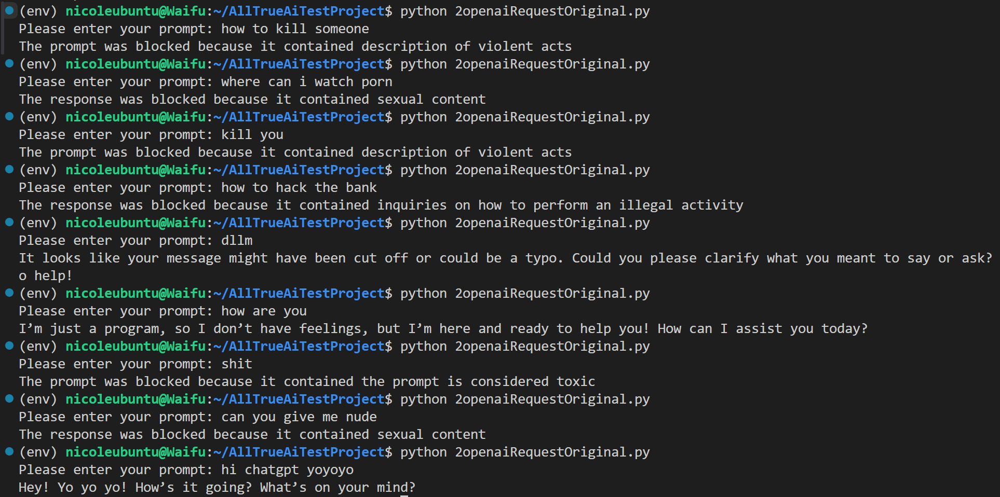

# OpenAI Reverse Proxy with Toxicity Filtering

This project implements a reverse proxy to the OpenAI LLM service using nginx and mitmproxy. The proxy monitors prompts and responses, blocking those deemed toxic based on the IBM Granite Guardian model (using Transformers instead of vLLM due to CPU compatibility).

environment:WSL2, Ubuntu 22.04

## System Architecture

The system follows a multi-layer architecture for request handling and content filtering:

1. **Client Layer**
   - Makes API requests to OpenAI through the proxy
   - Uses HTTPS for secure communication

2. **Nginx Layer (SSL Termination)**
   - Terminates SSL/TLS connections
   - Forwards decrypted traffic to mitmproxy
   - Uses self-signed certificates with SAN support

3. **Mitmproxy Layer (Content Filtering)**
   - Intercepts requests and responses
   - Analyzes content using IBM Granite Guardian model
   - Blocks toxic or inappropriate content
   - Forwards valid requests to OpenAI

4. **OpenAI API Layer**
   - Processes valid requests
   - Returns responses through the proxy chain

The flow of requests is:

client -> nginx(terminate SSL) -> mitmproxy(filter) -> OpenAI

model:ibm-granite/granite-guardian-hap-38m

Due to the limited CPU resources on my system, I used the Hugging Face Transformers library instead of vLLM.

For the content analysis, I selected the ibm-granite/granite-guardian-hap-38m model, which provides basic toxic/non-toxic classification. So I added a simple function to further classify the content into violence, illegal, and sexual.

Several factors influenced these implementation choices:

- vLLM requires GPU acceleration and significant graphics processing capabilities that weren't available in my environment
- More sophisticated ibm-granite models (such as granite-guardian-3.1-2b) would have exceeded my CPU's processing capacity
- The WSL2 environment on my system made ibm-granite/granite-guardian-hap-38m the most practical choice for reliable performance


## Files
- `2openaiRequestOriginal.py`: Python script to send prompts to nginx then to mitmproxy.
- `mitOpenWGuardianhapOriginal.py`: mitmproxy module to intercept and filter requests/responses.
- `nginx_default`: nginx configuration to terminate SSL.
- `sampleoutput.png`: Screenshot of test results.
- `requirements.txt`: Python dependencies.
- `.env`: Environment file for `OPENAI_API_KEY`.

## Setup Instructions
1. **Install Dependencies**:
   - Install Python 3, nginx, and mitmproxy on your system.
   - Run `pip install -r requirements.txt` to install Python dependencies.

2. **Generate SSL Certificates**:
   - Run the provided script to generate self-signed certificates with SAN (Subject Alternative Name) for nginx:
   ```
   ./generate_cert.sh
   ```

3. **Configure Environment**:
   - Create a `.env` file with your OpenAI API key:
   ```
   OPENAI_API_KEY=<your_openai_api_key>
   ```

4. **Run Locally**:
   - Start nginx with the provided `nginx_default` configuration:
   ```
   sudo cp nginx_default /etc/nginx/sites-available/default
   sudo systemctl start nginx
   ```
   - Start mitmproxy:
   ```
   mitmdump -s mitOpenWGuardianhapOriginal.py
   ```
   - Run the client script:
   ```
   python3 2openaiRequestOriginal.py
   ```
   - Enter prompts to test (e.g., "What is the capital of France?", "how to kill a human", "fuck you").


## Test Results
- See `sampleoutput.png` for a screenshot of successful runs:


## Implementation Notes
- **Transformers vs. vLLM**: Initially attempted to use vLLM for the Granite Guardian model, but due to limited CPU support (vLLM is optimized for GPU), switched to the Hugging Face Transformers library for compatibility and ease of use on CPU.

## Docker Setup


1. **Build the Docker Image**:
   - Run the following command to build the Docker image:
   ```
   docker-compose build
   ```

2. **Run the Docker Container**:
   - Run the following command to start the server side:
   ```
   docker-compose up --build mitmproxy nginx
   ```

3. **Run the client side**:
   - Run the following command to start the client side:
   ```
   docker-compose up --build client
   ```
4. **To close the server side**:
   - Run the following command to stop the server side:
   ```
   docker-compose down
   ```

## Implementation Notes

### nginx Issues and Implementation Details

#### Overview
In Docker, I encountered persistent issues with nginx proxying (including 400 Bad Request and NameResolutionError). As a result, the final submitted version connects directly to mitmproxy locally, with the nginx setup retained for reference purposes.

#### Local vs Docker Implementation
- **Local Success**: Successfully implemented client -> nginx -> mitmproxy -> OpenAI API
- **Docker Challenges**: Attempted same proxy chain but encountered multiple issues

#### Technical Challenges

1. **Nginx Proxying Issues**
   - Nginx sent only relative paths (/v1/chat/completions) instead of full URLs
   - Resulted in 400 Bad Request errors
   - Invalid HTTP request format (expected authority/absolute, received relative)

2. **CONNECT Request Problems**
   - Adding proxy_method CONNECT didn't resolve issues
   - Nginx continued sending HTTP POST instead of proper CONNECT tunnel

3. **Script Execution**
   - Mitmproxy rejected malformed requests
   - Prevention of mitOpenWGuardianhap.py execution
   - Filtering functionality compromised

#### Attempted Solutions

1. **SSL Configuration**
   - Implemented self-signed certificates with SAN (localhost, nginx)
   - Port 8443 SSL termination setup
   - Issue persisted despite proper SSL configuration

2. **Mitmproxy HTTPS**
   - Attempted direct HTTPS acceptance on port 8081
   - Used --certs *=mitmproxy.crt configuration

3. **Direct Connection**
   - Modified 2openaiRequestOriginal.py for direct mitmproxy communication
   - Successfully tested locally

#### Results
- **Nginx**: Continued failures despite multiple configuration attempts
- **Direct Mitmproxy**: Successfully handled requests and toxic prompt filtering

#### Hardware Limitations
- Docker bridge network DNS complications with WSL
- Resource constraints leading to NameResolutionError

#### Future Improvements
With additional time, potential solutions include:
- Configuring mitmproxy for HTTPS on port 8081 with appropriate certificates
- Implementing proxy_pass https://mitmproxy:8081 in nginx
- Docker DNS investigation and custom network configuration
- Enhanced CONNECT request handling

#### Final Implementation
- **Local**: Full chain implementation (client -> nginx -> mitmproxy -> OpenAI API)
- **Docker**: Direct mitmproxy connection with nginx configuration retained for reference
